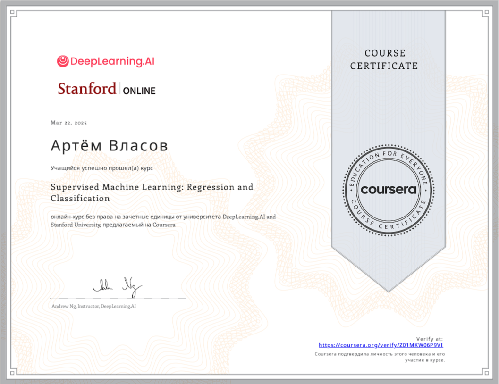

# Mashing Learning: Coursera Stanford (Andrew Ng)

\
This is a repository for my implementations, notebooks, and notes on the Machine Learning course of Stanford University/Coursera.

Taught by [Andrew Ng](http://www.andrewng.org/)

## 📌 Description
This repository contains my solutions and notes for the **Machine Learning** course by Stanford University, taught by **Andrew Ng** on the Coursera platform.

The course covers key machine learning concepts, including:
- Linear and logistic regression
- Neural networks
- Hyperparameter tuning
- Support Vector Machines (SVM)
- Ensemble methods
- Clustering (k-means) and dimensionality reduction (PCA)
- Anomaly detection and recommendation systems

## 📂 Repository Structure
```
├── Introduce_Into_ML/      # Week 2: Linear algebra, gradient descent
├── Linear_Regression/      # Week 3: Linear regression
├── Classification/      # Week 4: Logistic regression and Classification
├── Neural_Networks/      # Week 5: Neural networks (basics)
├── Neural_Network_Training/      # Week 6: Activation functions
├── Bias_Variance/      # Week 7: 
├── The_Decision_Tree/     # Week 8: Decision Tree
└── README.md   # This file
```

## 🛠 Installation and Usage
1. **Clone the repository:**
   ```bash
   git clone https://github.com/Artemiadze/Mashing-Learning-Cousera-Stanford.git
   cd Mashing-Learning-Cousera-Stanford
   ```

## 📜 License
This repository is intended for educational purposes only. Materials belong to Coursera and Stanford University.

## Accomplishments
<p align="center"> 
    
</p> 

<p align="center"> 
    
</p> 

## 🙌 Acknowledgments
Huge thanks to **Andrew Ng** for an outstanding course! 
If you find this repository useful, give it a ⭐ and share it with others!